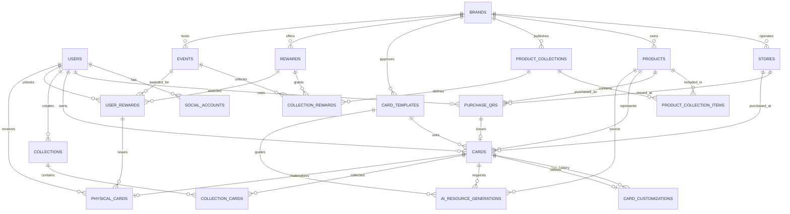

# ERD

## 기준

- 현재 DB 설계 기준 파일: `DataBase/Schema.sql`
- 식별자는 UUID 문자열을 사용한다.
- 상품과 경험은 `products`에서 함께 관리한다.
- 공식 컬렉션과 상품·경험은 연결 테이블을 통해 다대다로 연결한다.
- 구매 QR 하나당 디지털 카드 하나만 발급할 수 있다.

## 주요 테이블

### 사용자·인증

- `users`: 사용자 계정, 역할, 탈퇴 시각
- `social_accounts`: Google·Kakao 등 소셜 계정 연결

### 상품·컬렉션

- `brands`: 브랜드 기본 정보
- `stores`: 브랜드별 매장과 위치 정보
- `products`: 일반 제품과 Art, Gastronomy, Travel, Event 경험
  - `offering_type`: `PRODUCT`, `ART`, `GASTRONOMY`, `TRAVEL`, `EVENT`, `OTHER`
  - 시즌, 지역, 테마, 한정 여부, 판매 기간, 보증·케어 정보
- `product_collections`: 브랜드의 공식 컬렉션
- `product_collection_items`: 상품·경험과 공식 컬렉션의 다대다 연결
  - `id`를 PK로 사용한다.
  - `(product_collection_id, product_id)`는 UNIQUE 제약으로 중복을 방지한다.
  - `display_order`, `is_required`로 표시 순서와 달성 필수 여부를 관리

### 구매·디지털 카드

- `purchase_qrs`: 영수증 QR, 구매 상품, 구매 매장, 구매일
  - `qr_token`은 유일하다.
  - 미사용 QR은 `is_used = FALSE`, `used_by = NULL`, `used_at = NULL`이어야 한다.
  - 사용 QR은 `is_used = TRUE`이며 `used_by`, `used_at`이 존재해야 한다.
- `card_templates`: 브랜드 승인 카드 템플릿
  - `front_image_url`, `back_image_url`로 앞면·뒷면 이미지를 분리해 저장한다.
  - `allowed_card_type`이 NULL이면 BASIC·COLLECTOR 원본 카드에 사용할 수 있다.
- `cards`: 사용자 소유 디지털 카드
  - 구매 상품, 구매 매장, 구매 QR, 카드 템플릿을 연결한다.
  - `original_card_type`으로 최초 발급 타입을 보존한다.
  - `selected_customization_id`로 현재 선택한 커스터마이징 결과를 가리킨다.
  - `card_type`: `BASIC`, `CUSTOMIZE`, `COLLECTOR`
  - `status`: `ACTIVE`, `BLOCKED`, `REVOKED`
- `card_customizations`: 카드별 AI 커스터마이징 생성 이력
  - 카드 하나에 여러 이력을 저장할 수 있다.
  - 생성 결과는 `generated_front_image_url`, `generated_back_image_url`, `generated_message`, `customization_data`에 저장한다.
  - `generation_status`: `PENDING`, `COMPLETED`, `FAILED`, `REJECTED`, `ARCHIVED`
  - `REJECTED`: 검수 또는 정책 기준을 통과하지 못한 결과
  - `ARCHIVED`: 정상 생성됐지만 현재 사용하지 않는 과거 이력
  - 선택 상태는 `cards.selected_customization_id`에서 관리한다.
- `ai_resource_generations`: 카드에 조합할 AI 리소스 생성 요청과 결과 이력
  - 카드 완성본을 직접 생성하는 테이블이 아니라 배경·테두리·패턴·상품 각도 이미지 등의 후보 리소스를 관리한다.
  - `resource_type`: `BACKGROUND`, `BORDER`, `PATTERN`, `PRODUCT_ANGLE`, `DECORATION`, `COLOR_PALETTE`, `TEXT_STYLE`, `COMPOSITION`
  - `generation_status`: `PENDING`, `COMPLETED`, `FAILED`, `REJECTED`, `ARCHIVED`
  - `generated_data`에는 색상 조합, 레이아웃, 추천 옵션 등 이미지 외 결과를 JSON 문자열로 저장한다.
  - 실제 선택된 조합은 기존 `card_customizations.customization_data`에 저장하고, 생성 이력은 삭제하지 않는다.

### 사용자 컬렉션·리워드

- `collections`: 사용자가 만든 컬렉션 또는 AI 컬렉션
- `collection_cards`: 사용자 컬렉션과 디지털 카드의 다대다 연결
- `rewards`: 브랜드 리워드
- `events`: 브랜드 이벤트
- `collection_rewards`: 공식 컬렉션 달성률과 리워드·이벤트의 연결
- `user_rewards`: 사용자별 리워드 해금·수령 상태
- `physical_cards`: 구매 카드 또는 리워드 패스 형태의 실물 카드
  - `physical_token`은 실물 카드 식별자다.
  - `digital_card_id`는 디지털 카드 연결용으로 유지한다.
  - `user_reward_id`는 사용자에게 실제 발급된 리워드 연결용으로 유지한다.

## 관계

## 핵심 제약조건

- `social_accounts(provider, provider_user_id)`는 유일해야 한다.
- `purchase_qrs.qr_token`은 유일해야 한다.
- `cards.purchase_qr_id`는 유일해야 한다.
- `product_collection_items(product_collection_id, product_id)`는 중복될 수 없다.
- `card_customizations.card_id`는 유일하지 않으며, 카드별 복수 생성 이력을 허용한다.
- `cards.selected_customization_id`는 해당 카드의 커스터마이징 이력을 참조한다.
- 선택된 커스터마이징은 `COMPLETED` 상태인 결과만 참조해야 한다.
- `ai_resource_generations`는 카드 소유자만 생성·조회할 수 있다.
- AI 리소스 요청은 `PENDING`으로 먼저 저장하고, provider 처리 후 `COMPLETED`, `FAILED`, `REJECTED` 또는 `ARCHIVED`로 변경한다.
- `physical_cards`는 현재 `digital_card_id`와 `user_reward_id` 각각에 유니크 제약이 있다.
- 디지털 카드 하나당 실물 카드는 최대 1장만 발급한다.
- QR 조회, 카드 생성, QR 사용 처리는 하나의 트랜잭션으로 처리해야 한다.
- 실제 MySQL/JPA 구현에서는 QR 조회 시 비관적 잠금 적용이 필요하다.

## 확장 명세와 다른 부분 (의도적으로 유지)

방금 확정한 카드 도메인 명세와 `DataBase/Schema.sql`이 완전히 같지는 않다.

- `cards`의 매장 컬럼명은 `store_id`가 아니라 `purchase_store_id`다.
- `card_templates`는 `image_url` 하나로 합치지 않고 앞면·뒷면 이미지 컬럼을 유지한다.
- `physical_cards`는 `physical_token`, `digital_card_id`, `user_reward_id`를 사용한다.

따라서 이 문서는 현재 `Schema.sql`의 구조를 기준으로 확장한 ERD이며, 위 차이점은 카드 도메인 마이그레이션 시 추가로 정리해야 한다.
